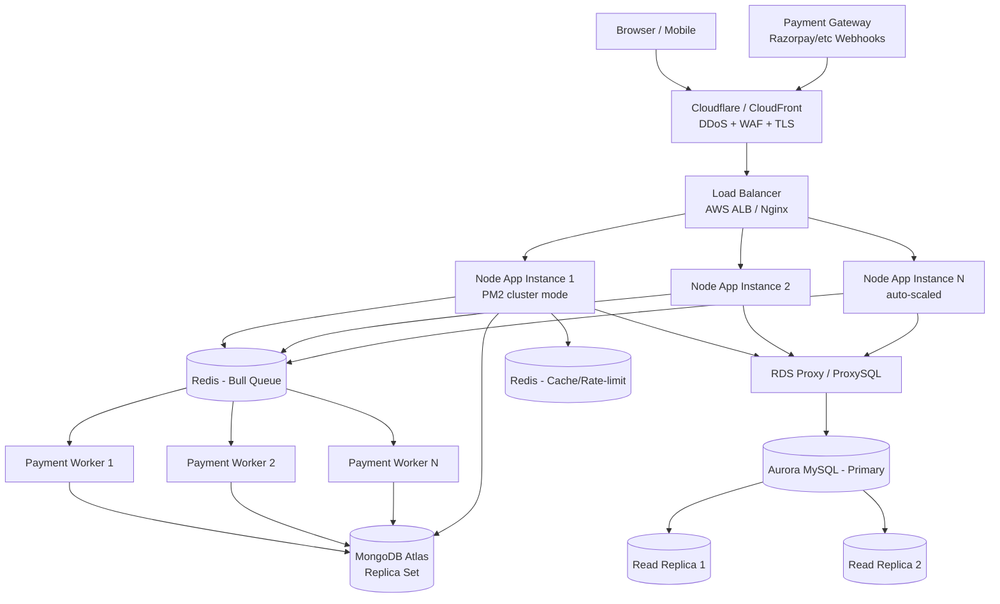

# Production Deployment Guide — Handling 5,000 req/sec with Real-Time Webhooks

This guide gives you a concrete, production-grade architecture for deploying this
MERN payment dashboard so it can sustain **~5,000 requests/second**, process
**payment gateway webhooks/callbacks in real time**, and keep MySQL + MongoDB +
Redis healthy under load — without breaking any existing functionality
(auth, dashboard, payouts, webhooks, queues).

---

## 1. Capacity Planning (why architecture matters)

A single Node.js process (even with clustering) realistically handles
**500–1,500 req/sec** for a DB-backed JSON API (your case: Sequelize + Mongoose +
bcrypt + JWT). To hit 5,000 req/sec reliably you need **horizontal scaling**,
not a bigger single server.

| Component | Bottleneck at scale | Fix |
|---|---|---|
| Node app | Single-threaded event loop | Run multiple instances (PM2 cluster + multiple containers) behind a load balancer |
| MySQL | Connection limit, write throughput | Managed MySQL (Aurora) + connection pooler + read replicas |
| MongoDB | Write throughput for transaction logs | MongoDB Atlas replica set (M-tier), proper indexes |
| Redis (Bull queue) | Single-threaded, network I/O | Managed Redis (ElastiCache/Upstash), dedicated instance, don't share with cache |
| Webhooks | Gateway will **retry & eventually disable your endpoint** if you're slow (>2–5s) or return non-2xx | Ack immediately, process asynchronously via queue |

**Rule of thumb:** `Total RPS ÷ RPS per instance = number of app instances needed`.
5,000 ÷ 800 ≈ **7 app instances minimum**, with auto-scaling to handle spikes.

---

## 2. Recommended Architecture



Key idea: **separate the webhook-receive path from the webhook-processing path**
using the Redis/Bull queue you already have (`src/workers/payment.worker.js`).
The HTTP handler should do almost nothing except validate + enqueue + respond `200`.

---

## 3. Compute (App Servers)

**Recommended: AWS ECS Fargate (or EKS if you already run Kubernetes) behind an
Application Load Balancer**, with Auto Scaling.

Why not raw EC2/VPS: containers + auto-scaling remove manual capacity management,
which matters when payment traffic spikes unpredictably.

- Package the app with Docker (Dockerfile for `src/app.js` backend, separate one
  for the Vite-built frontend served via CDN/static hosting — see §7).
- Run **PM2 in cluster mode inside each container** (`pm2 start src/app.js -i max`)
  so each container uses all vCPUs.
- Auto Scaling policy: target tracking on **ALB request count per target** (e.g.
  scale out at >600 req/sec/instance) AND on CPU >60%.
- Minimum 3 instances across 2+ Availability Zones (no single point of failure).
- Separate **Fargate service for payment workers** (`payment.worker.js`) so
  webhook processing scales independently from the public API.

**Instance sizing (Fargate task):** start at 1 vCPU / 2GB per API task, 0.5 vCPU /
1GB per worker task, then load-test and adjust (see §8).

**Budget alternative (smaller teams):** Render, Railway, or Fly.io — all support
autoscaling containers + managed Redis/Postgres add-ons. Good up to a few
thousand req/sec, less control at true enterprise scale.

**Not recommended for this app:** Vercel serverless functions — payment
webhooks need persistent Redis/queue workers and pooled DB connections;
serverless cold starts + per-invocation DB connections will exhaust MySQL
connection limits under bursty payment traffic.

---

## 4. Database Recommendations

### MySQL (Sequelize — users, transactions, charges)
- **Amazon Aurora MySQL** (or Aurora Serverless v2 if traffic is spiky) —
  auto-scaling storage, up to 15 read replicas, faster failover than plain RDS.
- Put **Amazon RDS Proxy** (or ProxySQL) in front of it. This is critical:
  at 5,000 req/sec, dozens of app instances opening raw connections will exhaust
  MySQL's `max_connections`. A proxy multiplexes many app connections onto a
  small pool of real DB connections.
- Route **read-only queries** (dashboard stats, reports) to read replicas;
  keep writes (transactions, payouts) on the primary.
- Add indexes on: `transaction_id`, `status`, `created_at`, `user_id` — anything
  in a `WHERE`/`ORDER BY` in `admin.controller.js`, `payment.controller.js`.
- Set Sequelize pool explicitly in `src/config/sequelize.js`:
  ```js
  pool: { max: 20, min: 2, acquire: 30000, idle: 10000 }
  ```
  (max per instance — multiply by instance count to size the RDS Proxy pool.)

### MongoDB (Mongoose — payout/transaction event logs)
- **MongoDB Atlas** dedicated cluster (M30+ for this throughput), 3-node replica
  set for HA, enable auto-scaling storage.
- Shard only if a single collection (e.g. `payoutTransaction`) exceeds what one
  replica set can handle (usually not needed until tens of thousands of writes/sec).
- Indexes on `transaction_id`, `reference_id`, `createdAt`, `status` — matches
  your queries in `admin.controller.js` (`.find().sort({createdAt:-1})`).
- Use **write concern `majority`** for payment-critical writes (don't lose money
  data on primary failover), but `w:1` is fine for logging/analytics writes.

### Redis (Bull queue + rate limiting/cache)
- **Amazon ElastiCache for Redis** (or Upstash for simpler ops) — use
  **two separate Redis instances/databases**: one dedicated to the Bull job
  queue, one for caching/rate-limiting (`rateLimiter.middleware.js`). Don't share —
  a burst of cache writes shouldn't ever delay payment job processing.
- Enable AOF or RDB persistence on the queue Redis (job data must survive restarts).
- Redis Cluster mode only if queue depth outgrows a single node's memory (rare
  until very high volume — monitor `used_memory` and queue length).

---

## 5. Webhooks & Callbacks — Real-Time, Reliable Processing

This is the most important part for a payment app. Gateways (Razorpay, etc.)
expect a **fast 2xx response** and will retry with backoff (and eventually
disable the webhook) if you're slow or return errors.

**Pattern to implement/verify in `payment.controller.js` / `payment.payout.js`:**

1. **Verify signature first, synchronously** (HMAC check) — reject invalid
   requests immediately with 400, before touching the DB or queue.
2. **Respond `200 OK` immediately** after enqueuing — do NOT wait for DB writes,
   settlement logic, or email/SMS notifications inside the webhook handler.
3. **Enqueue the raw payload to Bull** (`payment.worker.js` already exists for
   this) — the worker does the actual DB update, status transition, and any
   downstream notification.
4. **Idempotency**: store the gateway's event/transaction ID and check for
   duplicates before processing — gateways *will* send the same webhook more
   than once. Use a unique index on `transaction_id`/`reference_id` in Mongo/MySQL
   to make duplicate inserts fail safely.
5. **Timeouts**: set a strict Express timeout (e.g. 5s) on the webhook route so
   a slow DB doesn't hold the connection open and cause the gateway to retry
   unnecessarily.
6. **Dead-letter handling**: configure Bull with retry + backoff
   (`attempts: 5, backoff: { type: 'exponential', delay: 2000 }`) and a
   failed-job listener that alerts you (Slack/email) so failed payouts/charges
   are never silently dropped.
7. **Scale workers independently**: run 2–4 worker instances consuming the same
   queue so a spike of webhooks doesn't back up processing.

---

## 6. Networking, Security & Rate Limiting

- **Cloudflare or AWS CloudFront + WAF** in front of everything: absorbs DDoS,
  terminates TLS, caches static frontend assets.
- Terminate TLS at the load balancer; use ACM (AWS Certificate Manager) for
  auto-renewed certs.
- Keep `rateLimiter.middleware.js` active per-IP/per-API-key on public endpoints,
  but **whitelist the payment gateway's known webhook IP ranges** so legitimate
  webhook bursts are never rate-limited/dropped.
- Store secrets (`JWT_SECRET`, DB creds, gateway keys) in **AWS Secrets Manager**
  or **SSM Parameter Store** — never in `.env` files on the server.
- Enforce HTTPS-only webhook URLs with the gateway.

---

## 7. Frontend Delivery

- Build the Vite frontend (`npm run build` in `frontend/`) and deploy the static
  output to a **CDN** (CloudFront + S3, or Cloudflare Pages) — do not serve it
  from the same Node process as your API. This keeps API instances dedicated to
  request processing and gives the frontend near-infinite scale for free.

---

## 8. Observability & Load Testing (do this before go-live)

- **Metrics/logs:** CloudWatch or Grafana + Prometheus for CPU/memory/RPS per
  service; Winston logs (already in `src/utils/logger.js`) shipped to
  CloudWatch Logs / Datadog.
- **Error tracking:** Sentry for uncaught exceptions in both API and workers.
- **Health checks:** add a lightweight `/health` route (DB + Redis + Mongo ping)
  for the load balancer's target-health checks and container orchestrator.
- **Load test before launch** with [k6](https://k6.io) or Artillery:
  ```bash
  k6 run --vus 500 --duration 2m loadtest.js   # ramp toward 5000 rps
  ```
  Watch: p95/p99 latency, error rate, MySQL `Threads_connected`, Redis queue
  length, worker lag. Fix bottlenecks found here — don't discover them in
  production during a real payment spike.

---

## 9. Suggested Environment Tiers

| Tier | App instances | MySQL | MongoDB | Redis |
|---|---|---|---|---|
| Staging | 1–2 Fargate tasks | Aurora single instance | Atlas M10 | Single ElastiCache node |
| Production | 5–10+ auto-scaled | Aurora + 2 read replicas + RDS Proxy | Atlas M30+ replica set | ElastiCache (queue) + ElastiCache (cache), Multi-AZ |

---

## 10. Pre-Launch Checklist

- [ ] Webhook signature verification tested against gateway's test payloads
- [ ] Duplicate webhook delivery does not double-process a transaction (idempotency confirmed)
- [ ] Bull queue survives a Redis restart (persistence enabled, jobs not lost)
- [ ] RDS Proxy / connection pool sized for `app_instances × pool.max` ≤ DB connection limit
- [ ] Read replicas used for dashboard/report queries, not writes
- [ ] Auto-scaling tested by simulating load (k6/Artillery) to 5,000 rps
- [ ] Alerts wired up for: failed Bull jobs, 5xx rate, DB connection saturation, queue lag
- [ ] Secrets moved out of `.env` into Secrets Manager/SSM
- [ ] `/health` endpoint checked by load balancer before routing traffic to a new instance
- [ ] Frontend served from CDN, not from the API process

---

## 11. Estimated Monthly Cost (AWS-based architecture above)

Rough, real-world ranges in USD. Actual bill depends on region, reserved vs
on-demand pricing, and how much of the day you're actually near 5,000 rps
(most apps only hit peak for a few hours/day, so consider auto-scaling down
off-peak to cut costs significantly).

| Component | Staging | Production (sized for 5,000 rps peak) |
|---|---|---|
| ECS Fargate (API instances) | 1–2 tasks ≈ **$15–30/mo** | 7–10 auto-scaled tasks ≈ **$250–400/mo** |
| Fargate (payment workers) | 1 task ≈ **$10/mo** | 2–4 tasks ≈ **$70–140/mo** |
| Application Load Balancer | **$20/mo** | **$25–60/mo** (scales with request volume) |
| Aurora MySQL (primary + 2 replicas, db.r6g.large) | 1 instance ≈ **$150/mo** | 3 instances ≈ **$850–1,100/mo** |
| RDS Proxy | **~$10/mo** | **~$25–40/mo** |
| MongoDB Atlas (replica set) | M10 ≈ **$60/mo** | M30 ≈ **$400–550/mo** |
| ElastiCache Redis (queue + cache, 2 nodes) | 1 small node ≈ **$25/mo** | 2 nodes, Multi-AZ ≈ **$220–350/mo** |
| CloudFront/S3 (frontend + WAF) | **$10–20/mo** | **$40–100/mo** (traffic dependent) |
| Secrets Manager / CloudWatch / Sentry | **$10–20/mo** | **$60–150/mo** |
| **Total (approx.)** | **≈ $300–350/mo** | **≈ $1,950–2,900/mo** |

**Takeaways:**
- The database tier (Aurora + Atlas) is usually the single biggest line item —
  this is exactly where the Supabase idea below can meaningfully cut cost.
- You don't need to provision for peak 24/7 — auto-scaling down overnight/off-peak
  can realistically cut the production bill by 30–50%.
- These numbers assume on-demand pricing; 1-year Reserved Instances/Savings
  Plans on Aurora + Fargate typically save another 30–40% once traffic is stable.

---

## 12. Your Question: Can We Use Supabase Instead of Aurora MySQL?

**Short answer: yes, and it's a genuinely good idea for cost — with one real trade-off.**

Supabase = managed **Postgres** + built-in connection pooling (Supavisor, which
solves the exact "connection exhaustion" problem RDS Proxy was added for above)
+ auto REST/Realtime APIs + auth, all for a fraction of the Aurora + RDS Proxy cost.

| | Aurora MySQL + RDS Proxy | Supabase |
|---|---|---|
| Engine | MySQL | **PostgreSQL** (not MySQL — requires migration) |
| Connection pooling | RDS Proxy (extra service, extra cost) | **Built in** (Supavisor), no extra service |
| Read replicas | Yes, mature, multi-AZ | Yes, on Team/Enterprise plans |
| Cost at this scale | ~$850–1,100/mo (prod) | Roughly **$220–650/mo** (Pro + Large/XL compute add-on) for comparable throughput |
| Multi-region writes | Yes (Aurora Global Database) | Limited (single primary region for writes) |
| Ops maturity at very high sustained write throughput | Very high (purpose-built for this) | Good, but you're on regular Postgres vertically scaled — solid up to a large compute add-on, less battle-tested than Aurora at extreme sustained write volume |

**The catch:** your current backend uses **Sequelize with the MySQL dialect**
(`src/config/sequelize.js`, `src/models/*`). Moving to Supabase means moving to
Postgres, which requires:
- Changing Sequelize's dialect to `postgres` (Sequelize supports this natively —
  no framework change needed).
- Reviewing MySQL-specific SQL/data types in your models (e.g. `AUTO_INCREMENT`
  → Postgres `SERIAL`/`IDENTITY`, some function/collation differences).
- Re-testing all queries in `admin.controller.js`, `payment.controller.js`, etc.
  for MySQL-only syntax.

This is a **moderate, well-scoped migration** (not a rewrite) — realistic for a
weekend-to-a-week of focused work depending on how much raw SQL vs. Sequelize
ORM calls you have.

**My recommendation:** if you're pre-scale or early-stage and want to control
cost, **Supabase is a smart choice** — you get pooling for free (removing the
RDS Proxy need entirely) and a much lower bill. Once you're consistently
sustaining 5,000+ req/sec of real production traffic with heavy write volume,
re-evaluate — that's the point where Aurora's purpose-built scaling story starts
to matter more than the cost savings.

(Note: Supabase doesn't replace MongoDB Atlas or Redis/ElastiCache in this
architecture — those stay as-is. Supabase would only replace the MySQL/Aurora
layer.)
